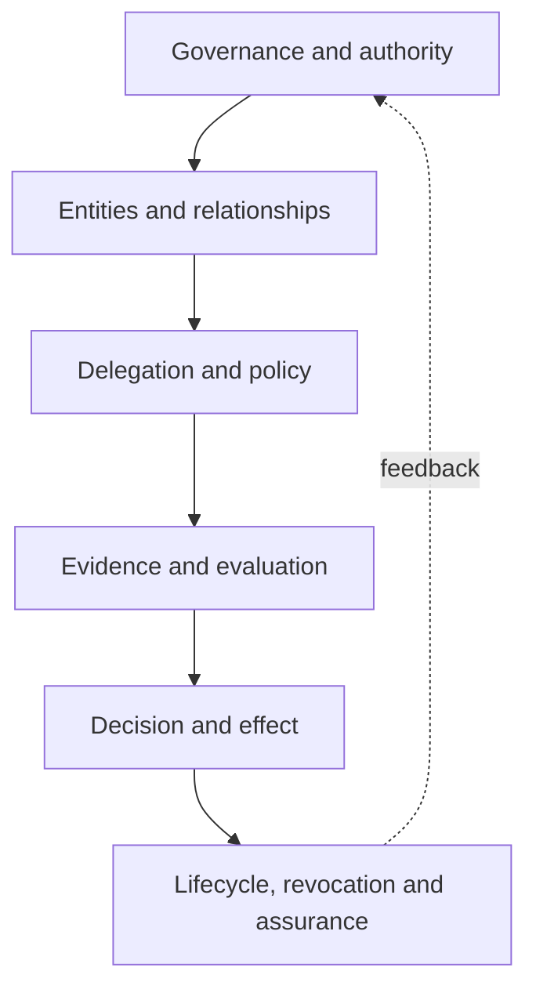

# Architecture

TSMM is the canonical semantic layer of the flagship stack. It defines trust-system entities, authority and delegation relationships, evidence and assessment semantics, trust decisions, effects, graph constraints, bindings, and conformance profiles.

## Layers

1. **Core model:** stable semantic vocabulary and structural constraints.
2. **Extensions:** bounded additions for agentic systems, assurance, runtime governance, and ecosystem-specific needs.
3. **Bindings:** declared mappings to external ecosystems with maturity, guarantees, limitations, and behavioral expectations.
4. **Graphs and profiles:** machine-verifiable system representations and conformance expectations.

TIS projects these semantics into portable contracts. TGA uses TSMM semantics in executable governance packages and implementation guidance.

## Model architecture

