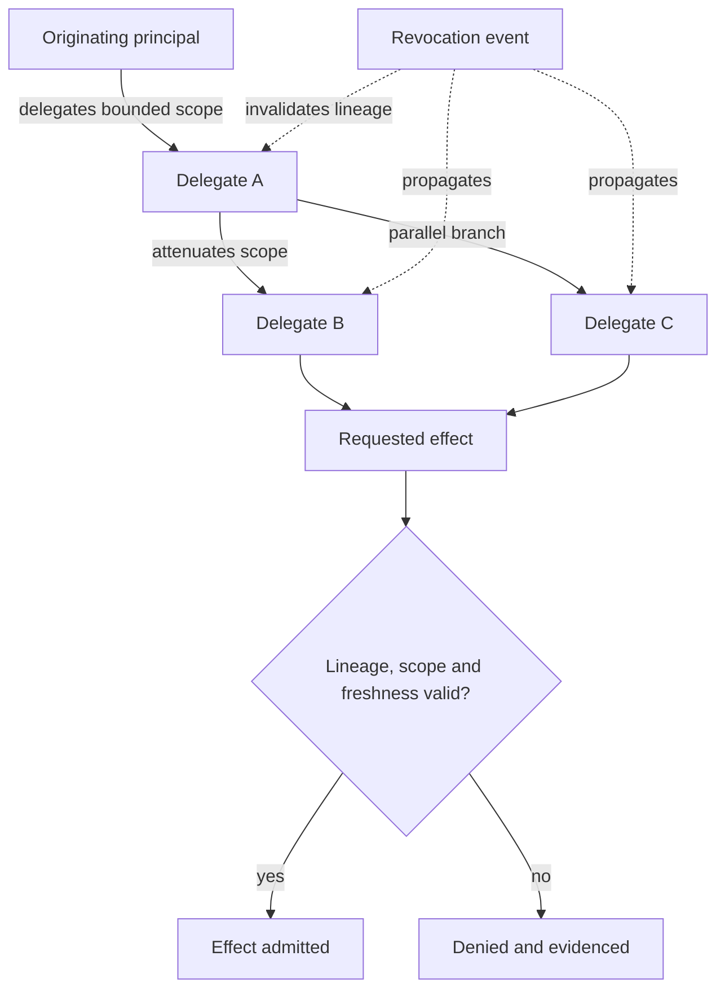

# Delegated authority assurance flow

This walkthrough demonstrates the portfolio control path without claiming production certification.

1. **TSMM** defines the originating principal, delegate, scope, attenuation, revocation, evidence, decision, and effect semantics.
2. **TIS** expresses authority, delegation lineage, evidence, and receipt data as portable machine-readable contracts.
3. **TGA** composes the governance pattern and evaluates positive and negative scenarios.
4. Repository validators produce traceable evidence records.

## Required scenarios

| Scenario | Expected result |
|---|---|
| Valid bounded delegation | Effect may be admitted and a decision receipt produced |
| Scope escalation | Evaluation fails closed |
| Revoked delegation | Effect is denied and the revocation basis is recorded |
| Broken lineage | Authority claim is rejected |

## Evidence

The evidence chain must identify the semantic requirement, schema contract, implementation pattern, validation result, and assurance limitation.

## Delegation lineage and revocation

