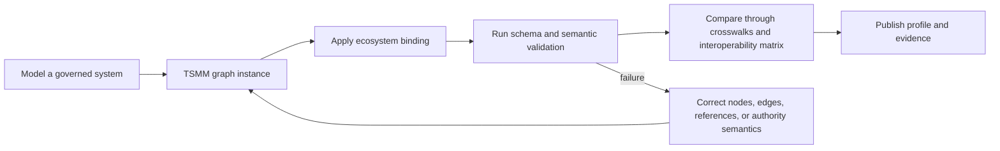

# TSMM Graph Model

The graph layer is now the shortest route into TSMM.

Instead of beginning with prose and then asking implementers to translate that prose into their own diagrams, TSMM now provides a graph-first surface that can be modeled, rendered, validated, and compared directly. That matters because a meta-model starts to become operational only when people can express systems in a form that tooling can inspect.

## Why the graph layer is central

The graph layer is where the repository's main promises meet each other:

- the **core model** provides the abstractions
- the **binding layer** connects those abstractions to concrete ecosystems
- the **validation layer** rejects structurally incoherent examples
- the **interoperability layer** compares systems once they share a common topology vocabulary

In other words, the graph is where TSMM stops being only a reference model and starts behaving like a usable modeling surface.


## Graph-to-assurance workflow



The workflow makes validation a gate rather than a documentation afterthought. A system is publishable only after its topology, references, and governed relationships pass the repository's machine-verifiable checks.

## Core artifacts

The graph layer now has three anchor points:

1. `schemas/tsmm-graph.schema.json` — the canonical graph schema
2. `model/graph/tsmm.graph.json` — the canonical graph instance used as the main branch reference topology
3. `scripts/validate_tsmm_graph.py` — graph validation with schema and semantic checks

Alongside those anchors are reusable examples and rendering support:

- `examples/tsmm-ecosystem-example.json`
- `examples/profiles/`
- `examples/systems/`
- `scripts/render_tsmm_graph.py`
- `examples/registries/tsmm-registry-example.json`

## What the canonical graph does

`model/graph/tsmm.graph.json` is not meant to describe one protocol or one product. It is the compact reference topology for the recurring TSMM path:

**authority → policy/profile → issuance/verification → evidence/assessment → trust decision → operational effect**

That reference path gives contributors a concrete place to start before moving into ecosystem-specific system examples.

## Node classes

The schema currently supports these node classes:

- `TrustDomain`
- `GovernanceAuthority`
- `TrustRegistry`
- `RegistryService`
- `Issuer`
- `Verifier`
- `Subject`
- `Agent`
- `Credential`
- `Policy`
- `AssuranceProfile`
- `EvidenceBundle`
- `Assessment`
- `TrustDecision`
- `Effect`
- `RelyingParty`

## Relationship classes

The graph schema and validator support a controlled relationship vocabulary:

- `governs`
- `defines`
- `operates`
- `registers`
- `authorizes`
- `issues`
- `verifies`
- `asserts`
- `delegates`
- `constrains`
- `substantiates`
- `assesses`
- `informs`
- `produces`
- `reliesOn`
- `anchors`
- `publishes`

That list is intentionally smaller than the total number of relationships one might imagine. The goal is not to capture every nuance in one schema. The goal is to provide a stable vocabulary that remains reusable across examples and bindings.

## What gets validated

The graph validator checks for:

- schema conformance
- duplicate node identifiers
- duplicate edge identifiers
- missing node references
- illegal relation pairings
- invalid `evidenceRefs`
- missing metadata file references such as `bindingRef`, `comparisonRef`, `validationProfileRef`, and `registryRef`

This means the graph layer is not just a diagram format. It is a constrained modeling surface with enough semantics to catch common structural mistakes early.

## Example coverage

The graph examples now cover multiple starting points:

### Canonical graph
- `model/graph/tsmm.graph.json`

### Reference ecosystem and profiles
- `examples/tsmm-ecosystem-example.json`
- `examples/profiles/ssi-ecosystem.json`
- `examples/profiles/agent-trust-network.json`
- `examples/profiles/agent-governance-network.json`
- `examples/profiles/trust-registry-federation.json`
- `examples/profiles/dpi-trust-layer.json`

### Concrete systems
- `examples/systems/trqp-registry-system.json`
- `examples/systems/openid-federation-system.json`
- `examples/systems/decentralized-directory-system.json`
- `examples/systems/content-authenticity-workflow.json`
- `examples/systems/verifiable-trust-community-system.json`

This spread matters because contributors usually need different entry points. Some want a compact canonical topology. Others want a federation example. Others need a concrete workflow they can adapt.

## Rendering

You can render a graph example directly.

```bash
python scripts/render_tsmm_graph.py model/graph/tsmm.graph.json --format mermaid --cluster
```

Or render a concrete system example:

```bash
python scripts/render_tsmm_graph.py examples/systems/content-authenticity-workflow.json --format dot
```

## How the graph layer fits the repo

A practical way to use the repo is:

1. start from the **canonical graph**
2. adapt the graph into a **system example**
3. connect it to an **ecosystem binding**
4. run the **validators**
5. compare it with adjacent systems through the **interoperability layer**

That sequence gives the repository a clearer shape around **model, bind, validate, compare** rather than leaving readers to infer how the parts relate.

## Related artifacts

- [Model, Bind, Validate, Compare](../getting-started/model-bind-validate-compare.md)
- [Core model](../core-model.md)
- [Authority graph](authority-graph.md)
- [Delegation patterns](delegation-patterns.md)
- [Interoperability layer](../interop/interoperability.md)
- [System examples](../examples/system-examples.md)
