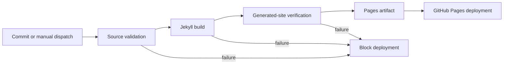

# GitHub Pages Deployment

TSMM publishes the complete documentation set as a project site at:

`https://sankarshanmukhopadhyay.github.io/trust-systems-meta-model/`

## Publishing contract

The repository uses `.github/workflows/pages.yml` as the authoritative publication path. The workflow:

1. validates source links and version metadata
2. validates Mermaid source blocks
3. builds the Jekyll and Just the Docs site
4. verifies generated HTML, internal navigation, and the Mermaid bootstrap asset
5. uploads one Pages artifact
6. deploys only from a non-pull-request run



## Required repository setting

Under **Settings → Pages → Build and deployment**, the publishing source must be **GitHub Actions**. The workflow also requests Pages enablement through `actions/configure-pages`, but the repository setting remains the visible authority for the publication source.

## Link handling

Documentation authors may use repository-relative Markdown links ending in `.md`. The `jekyll-relative-links` plugin converts those source links into generated site links during the build. This prevents otherwise-valid repository navigation from producing `.md` URLs that do not exist in the deployed site.

## Mermaid handling

Mermaid diagrams remain fenced Markdown blocks in source. `_includes/head_custom.html` loads `assets/js/mermaid-init.js`, which converts rendered Mermaid code blocks into diagrams in the browser. `scripts/validate_mermaid.py` checks the source syntax class, and `scripts/check_built_site.py` confirms that the bootstrap asset is present in the generated site.

## Local validation

Run the repository validation suite before publishing:

```bash
make candidate-check
bundle exec jekyll build --trace
python3 scripts/check_built_site.py
```

The final command must report generated HTML coverage, internal-link integrity, a root landing page, and the Mermaid asset.

## Failure evidence

A failed source, build, or generated-site validation step blocks deployment and leaves the GitHub Actions log as audit evidence. Candidate validation evidence is written under `artifacts/validation/` and `artifacts/candidate/`.
