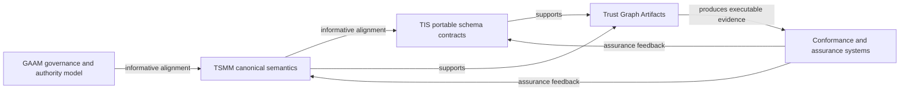

# Portfolio relationships

The arrows describe bounded relationships, not shared release authority. TSMM does not own TIS serialization decisions, and TIS does not redefine TSMM canonical semantics.
